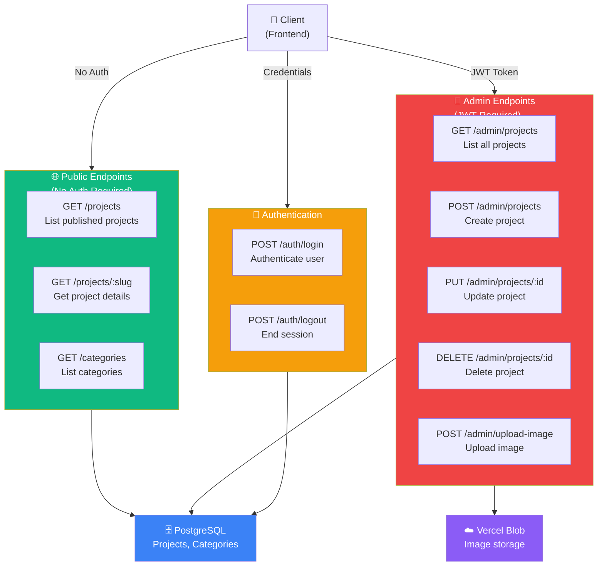

# GeniuzLab Portfolio - API Documentation

## API Overview



---

## Base URL

### Development
```
http://localhost:3001/api
```

### Production
```
https://api.geniuzlab.com/api
```

---

## Authentication

All admin endpoints require a valid JWT token in the `Authorization` header:

```
Authorization: Bearer <jwt-token>
```

Admin endpoints are prefixed with `/api/admin/` and require authentication.

---

## Public Endpoints

### GET /projects

Get all published projects.

**Query Parameters:**
- `category` (optional) - Filter by category slug
- `limit` (optional, default: 50) - Max number of results
- `offset` (optional, default: 0) - Pagination offset

**Response:**
```json
{
  "projects": [
    {
      "id": "uuid",
      "slug": "project-slug",
      "title": "Project Title",
      "client": "Client Name",
      "year": 2024,
      "role": "Brand Identity",
      "summary": "Short description",
      "featured": true,
      "published": true,
      "categories": [
        {
          "id": "uuid",
          "slug": "graphic-design",
          "label": "Graphic Design"
        }
      ],
      "images": [
        {
          "id": "uuid",
          "type": "COVER",
          "url": "https://...",
          "altText": "Project cover",
          "width": 1200,
          "height": 800
        }
      ]
    }
  ],
  "total": 42
}
```

**Example:**
```bash
curl http://localhost:3001/api/projects?category=graphic-design&limit=10
```

---

### GET /projects/:slug

Get a single published project by slug.

**Response:**
```json
{
  "project": {
    "id": "uuid",
    "slug": "project-slug",
    "title": "Project Title",
    "client": "Client Name",
    "year": 2024,
    "role": "Brand Identity",
    "summary": "Short description",
    "description": "Detailed project description",
    "featured": true,
    "published": true,
    "categories": [...],
    "images": [...],
    "tags": [
      {
        "id": "uuid",
        "name": "branding"
      }
    ]
  }
}
```

**Status Codes:**
- `200` - Success
- `404` - Project not found

**Example:**
```bash
curl http://localhost:3001/api/projects/my-project-slug
```

---

### GET /categories

Get all portfolio categories.

**Response:**
```json
{
  "categories": [
    {
      "id": "uuid",
      "slug": "graphic-design",
      "label": "Graphic Design",
      "description": "Visual design work",
      "projectCount": 12
    }
  ]
}
```

**Example:**
```bash
curl http://localhost:3001/api/categories
```

---

## Admin Endpoints (Protected)

All admin endpoints require a valid JWT token. Add to request header:

```
Authorization: Bearer <your-jwt-token>
```

---

### POST /admin/login

Authenticate and get JWT token.

**Request Body:**
```json
{
  "email": "admin@example.com",
  "password": "your-password"
}
```

**Response:**
```json
{
  "token": "eyJhbGciOiJIUzI1NiIs...",
  "user": {
    "id": "uuid",
    "email": "admin@example.com"
  }
}
```

**Status Codes:**
- `200` - Login successful
- `401` - Invalid credentials
- `400` - Missing email or password

**Example:**
```bash
curl -X POST http://localhost:3001/api/admin/login \
  -H "Content-Type: application/json" \
  -d '{"email":"admin@example.com","password":"password"}'
```

---

### GET /admin/projects

Get all projects (including unpublished) for admin.

**Query Parameters:**
- `limit` (optional, default: 50)
- `offset` (optional, default: 0)
- `published` (optional) - Filter by published status (true/false)

**Headers:**
```
Authorization: Bearer <jwt-token>
```

**Response:**
```json
{
  "projects": [
    {
      "id": "uuid",
      "slug": "project-slug",
      "title": "Project Title",
      "published": false,
      "featured": false,
      "year": 2024,
      "thumbnailUrl": "https://...",
      "createdAt": "2024-01-15T10:30:00Z",
      "updatedAt": "2024-01-15T10:30:00Z"
    }
  ],
  "total": 42
}
```

**Example:**
```bash
curl http://localhost:3001/api/admin/projects \
  -H "Authorization: Bearer <token>"
```

---

### POST /admin/projects

Create a new project.

**Headers:**
```
Authorization: Bearer <jwt-token>
Content-Type: application/json
```

**Request Body:**
```json
{
  "title": "New Project",
  "slug": "new-project",
  "client": "Client Name",
  "year": 2024,
  "role": "Brand Identity",
  "summary": "Short description",
  "description": "Detailed description",
  "featured": true,
  "published": false,
  "categories": ["graphic-design", "branding"],
  "tags": ["design", "branding"],
  "images": []
}
```

**Response:**
```json
{
  "project": {
    "id": "uuid",
    "slug": "new-project",
    "title": "New Project",
    "created At": "2024-01-15T10:30:00Z",
    ...
  }
}
```

**Status Codes:**
- `201` - Project created
- `400` - Invalid input (missing required fields, invalid slug)
- `401` - Unauthorized
- `409` - Slug already exists

**Example:**
```bash
curl -X POST http://localhost:3001/api/admin/projects \
  -H "Authorization: Bearer <token>" \
  -H "Content-Type: application/json" \
  -d '{
    "title": "New Project",
    "slug": "new-project",
    "year": 2024,
    "summary": "A great project"
  }'
```

---

### GET /admin/projects/:id

Get a specific project for editing.

**Headers:**
```
Authorization: Bearer <jwt-token>
```

**Response:**
```json
{
  "project": {
    "id": "uuid",
    "slug": "project-slug",
    "title": "Project Title",
    ...full project details...
  }
}
```

**Status Codes:**
- `200` - Success
- `404` - Project not found
- `401` - Unauthorized

**Example:**
```bash
curl http://localhost:3001/api/admin/projects/project-uuid \
  -H "Authorization: Bearer <token>"
```

---

### PUT /admin/projects/:id

Update an existing project.

**Headers:**
```
Authorization: Bearer <jwt-token>
Content-Type: application/json
```

**Request Body:**
```json
{
  "title": "Updated Title",
  "published": true,
  ...other fields to update...
}
```

**Response:**
```json
{
  "project": {
    ...updated project...
  }
}
```

**Status Codes:**
- `200` - Updated successfully
- `400` - Invalid input
- `404` - Project not found
- `401` - Unauthorized

**Example:**
```bash
curl -X PUT http://localhost:3001/api/admin/projects/project-uuid \
  -H "Authorization: Bearer <token>" \
  -H "Content-Type: application/json" \
  -d '{"published": true}'
```

---

### DELETE /admin/projects/:id

Delete a project.

**Headers:**
```
Authorization: Bearer <jwt-token>
```

**Response:**
```json
{
  "success": true,
  "message": "Project deleted"
}
```

**Status Codes:**
- `200` - Deleted successfully
- `404` - Project not found
- `401` - Unauthorized

**Example:**
```bash
curl -X DELETE http://localhost:3001/api/admin/projects/project-uuid \
  -H "Authorization: Bearer <token>"
```

---

### POST /admin/upload-image

Upload an image to the configured storage provider (Vercel Blob or Cloudinary).

**Note:** Frontend currently uses Vercel Blob. For Cloudinary uploads, use the backend `/api/upload` endpoint or configure Cloudinary Upload Widget on the frontend. See [DOCS/CLOUDINARY.md](CLOUDINARY.md) for details.

**Headers:**
```
Authorization: Bearer <jwt-token>
Content-Type: multipart/form-data
```

**Form Data:**
- `file` (required) - Image file (JPEG, PNG, WebP, GIF)
- `provider` (optional) - "vercel-blob" or "cloudinary" (default: configured provider)
- `type` (optional) - "COVER" or "GALLERY" (default: "GALLERY")

**Response (Vercel Blob):**
```json
{
  "url": "https://blob.vercelusercontent.com/...",
  "filename": "image-1704033000000.jpg",
  "provider": "vercel-blob"
}
```

**Response (Cloudinary):**
```json
{
  "url": "https://res.cloudinary.com/.../image.jpg",
  "filename": "portfolio/image",
  "provider": "cloudinary",
  "publicId": "portfolio/image",
  "resourceType": "image"
}
```

**Status Codes:**
- `200` - Upload successful
- `400` - No file provided or invalid file type
- `413` - File too large (max 50MB for Vercel Blob, 2GB for Cloudinary)
- `401` - Unauthorized
- `503` - Storage not configured

**Example:**
```bash
# Using Vercel Blob (default)
curl -X POST http://localhost:3001/api/admin/upload-image \
  -H "Authorization: Bearer <token>" \
  -F "file=@path/to/image.jpg" \
  -F "type=COVER"

# Using Cloudinary (if configured)
curl -X POST http://localhost:3001/api/admin/upload-image \
  -H "Authorization: Bearer <token>" \
  -F "file=@path/to/image.jpg" \
  -F "provider=cloudinary" \
  -F "type=COVER"
```

---

### GET /admin/categories

Get all categories.

**Headers:**
```
Authorization: Bearer <jwt-token>
```

**Response:**
```json
{
  "categories": [
    {
      "id": "uuid",
      "slug": "graphic-design",
      "label": "Graphic Design",
      "description": "Visual design work"
    }
  ]
}
```

**Example:**
```bash
curl http://localhost:3001/api/admin/categories \
  -H "Authorization: Bearer <token>"
```

---

### POST /admin/categories

Create a new category.

**Headers:**
```
Authorization: Bearer <jwt-token>
Content-Type: application/json
```

**Request Body:**
```json
{
  "slug": "illustration",
  "label": "Illustration",
  "description": "Illustration and digital art"
}
```

**Response:**
```json
{
  "category": {
    "id": "uuid",
    "slug": "illustration",
    "label": "Illustration",
    "description": "Illustration and digital art"
  }
}
```

**Status Codes:**
- `201` - Created successfully
- `400` - Invalid input
- `409` - Slug already exists
- `401` - Unauthorized

---

## Error Responses

All error responses follow this format:

```json
{
  "error": "Error message",
  "code": "ERROR_CODE",
  "details": {...additional info...}
}
```

### Common Error Codes

| Code | Status | Description |
|------|--------|-------------|
| `UNAUTHORIZED` | 401 | Missing or invalid JWT token |
| `INVALID_INPUT` | 400 | Request validation failed |
| `NOT_FOUND` | 404 | Resource not found |
| `CONFLICT` | 409 | Resource already exists (e.g., slug conflict) |
| `FILE_TOO_LARGE` | 413 | Uploaded file exceeds size limit |
| `INVALID_FILE_TYPE` | 400 | File type not supported |
| `INTERNAL_ERROR` | 500 | Server error |

---

## Rate Limiting

Currently not enforced, but recommended for production:

- Public endpoints: 100 requests/minute per IP
- Admin endpoints: 30 requests/minute per token

---

## CORS

**Allowed Origins:**
- `http://localhost:3000` (development)
- `https://geniuzlab.com` (production)

Set via `CORS_ORIGIN` environment variable.

---

## Pagination

Endpoints that return lists support pagination:

**Query Parameters:**
- `limit` - Number of results (default: 50, max: 100)
- `offset` - Starting position (default: 0)

**Response:**
```json
{
  "data": [...],
  "total": 42,
  "limit": 50,
  "offset": 0,
  "hasMore": false
}
```

---

## Testing the API

### Using cURL

```bash
# Get public projects
curl http://localhost:3001/api/projects

# Login
TOKEN=$(curl -s -X POST http://localhost:3001/api/admin/login \
  -H "Content-Type: application/json" \
  -d '{"email":"admin@example.com","password":"password"}' \
  | jq -r '.token')

# Get admin projects with token
curl http://localhost:3001/api/admin/projects \
  -H "Authorization: Bearer $TOKEN"
```

### Using Postman

1. Import the base URL: `http://localhost:3001/api`
2. Set up a login request to get the token
3. Use the token in subsequent admin requests via the `Authorization` header

### Using Thunder Client (VS Code)

Similar to Postman - create requests with the token in headers.

---

## API Client Libraries

For frontend consumption, the web app provides helper utilities in `lib/api.ts`:

```typescript
import { api } from '@/lib/api';

// Get projects
const projects = await api.getProjects();

// Get single project
const project = await api.getProject('project-slug');

// Admin operations (requires auth)
const categories = await api.admin.getCategories(token);
await api.admin.createProject(token, projectData);
```

---

## Versioning

Currently at **v1.0.0** (no versioning in API URLs).

For future versions, endpoints will be prefixed with `/api/v2/`, `/api/v3/`, etc.

---

## Support

For API issues or questions:
- Check the [TECHNICAL.md](TECHNICAL.md) for architecture details
- Review the [backend README](../../apps/backend/README.md) for setup
- Create an issue on GitHub with API error details
