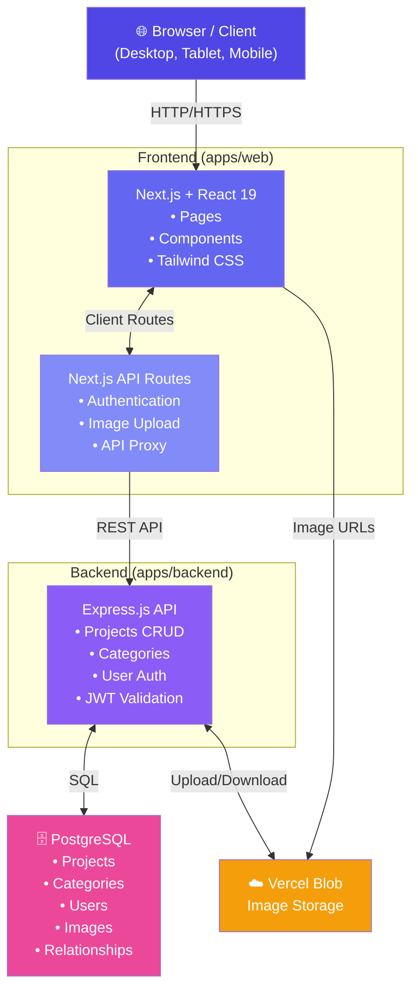
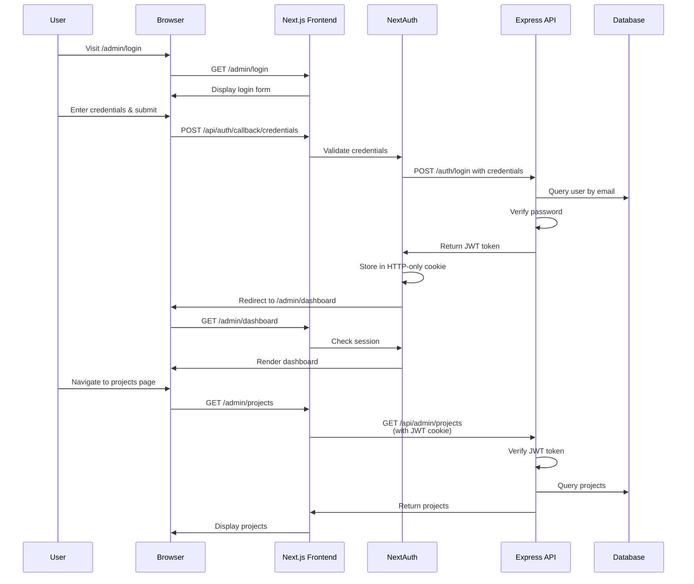
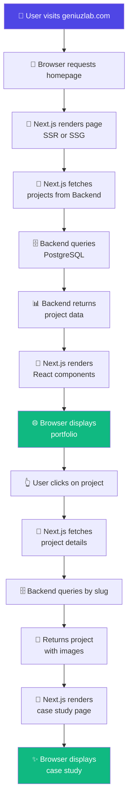
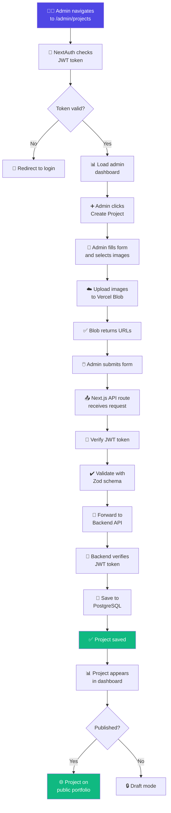
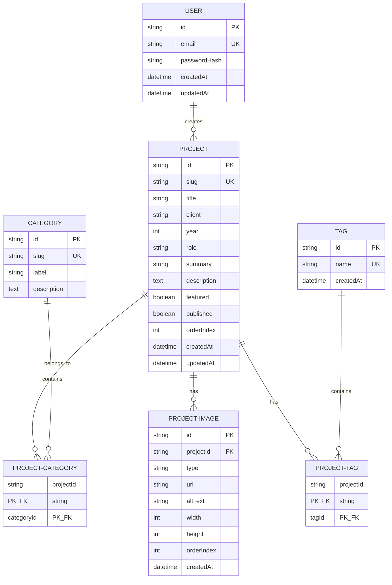

# GeniuzLab Portfolio - Architecture & Design

## System Architecture Overview



---

## Monorepo Structure

### Why Monorepo?

1. **Shared Code** - Types, constants, utilities shared across apps
2. **Unified Versioning** - Single package-lock.json for consistency
3. **Easier Refactoring** - Change shared code once, applies everywhere
4. **Scalability** - Easy to add mobile app, multiple backends, etc.
5. **Single Repo** - One git history, simpler CI/CD

### Workspace Layout

```
packages/
└── shared/                    # Shared types, constants, utils
    └── src/
        ├── types/            # TypeScript interfaces
        ├── constants/        # Site configuration
        └── utils/            # Helper functions

apps/
├── web/                       # Frontend (Next.js + React)
│   ├── app/                  # App Router (pages, layouts, API routes)
│   ├── components/           # React components
│   ├── lib/                  # Frontend business logic
│   ├── hooks/                # Custom React hooks
│   ├── public/               # Static assets (images, fonts)
│   ├── auth.ts               # NextAuth configuration
│   └── package.json
│
├── backend/                   # Backend API (Express.js)
│   ├── src/
│   │   ├── index.ts          # Server entry point
│   │   ├── lib/              # Business logic, services
│   │   ├── routes/           # API endpoints
│   │   └── middleware/       # Express middleware
│   └── package.json
│
└── mobile/                    # Future: React Native or Flutter
    └── (placeholder)
```

---

## Technology Decisions

### Frontend: Next.js 16 + React 19

**Why?**
- ✅ Full-stack capabilities (frontend + API routes)
- ✅ Server-side rendering (SSR) for SEO-friendly portfolio
- ✅ Static generation (SSG) for fast portfolio pages
- ✅ Built-in image optimization
- ✅ TypeScript first-class support
- ✅ Excellent developer experience (hot reload)

**Alternatives Considered:**
- Vite + React - Simpler but lacks full-stack features
- Remix - Good alternative but heavier learning curve

### Backend: Express.js (Separate)

**Why?**
- ✅ Full control over API design and authentication
- ✅ Independent scaling from frontend
- ✅ Better for future mobile app API
- ✅ Clean separation of concerns
- ✅ Easier testing and deployment

**Frontend stays on Next.js** because:
- Portfolio pages need SSR/SSG for SEO
- Admin routes can use Next.js API routes as proxy
- Simpler deployment of frontend

### Database: PostgreSQL + Prisma

**Why?**
- ✅ Type-safe ORM with TypeScript support
- ✅ Excellent migration system
- ✅ Works with PostgreSQL (enterprise-grade)
- ✅ Built-in schema validation
- ✅ Great developer experience

### Authentication: NextAuth.js + JWT

**Strategy:**
1. **Frontend auth** - NextAuth.js (Session management)
2. **Backend auth** - JWT tokens (API validation)
3. **Credentials flow** - Email + password (no external providers needed)
4. **Token storage** - HTTP-only cookies (secure, XSS-proof)

**Authentication Flow:**



---

## Data Flow

### Public Portfolio Browsing



### Admin Publishing a Project



---

## Key Design Patterns

### 1. API Layer Abstraction

**Frontend** has utility functions in `lib/api.ts`:

```typescript
// Encapsulates all API calls
export const api = {
  getProjects: () => fetch('/api/projects'),
  getProject: (slug: string) => fetch(`/api/projects/${slug}`),
  admin: {
    createProject: (data) => fetch('/api/admin/projects', { method: 'POST', body: JSON.stringify(data) }),
  }
}
```

**Benefits:**
- Centralized API logic
- Easy to change endpoints
- Type-safe requests

### 2. Type Sharing via Shared Package

**packages/shared/src/types/index.ts:**

```typescript
export interface Project {
  id: string;
  slug: string;
  title: string;
  // ... other fields
}
```

**Usage in Frontend:**
```typescript
import type { Project } from '@geniuzlab/shared/types';

const project: Project = await api.getProject('slug');
```

**Usage in Backend:**
```typescript
import type { Project } from '@geniuzlab/shared/types';

router.get('/projects/:slug', (req, res) => {
  const project: Project = db.projects.findOne({ slug: req.params.slug });
  res.json(project);
});
```

**Benefits:**
- Single source of truth for types
- Prevents frontend/backend desync
- Type-safe API contracts

### 3. Environment Configuration

**Each app has its own .env file:**

- `apps/web/.env.local` - Frontend config (NEXT_PUBLIC_*)
- `apps/backend/.env.local` - Backend config
- `.env.local` - Shared config (DATABASE_URL, AUTH_SECRET)

**Why separate?**
- Frontend only needs public URLs
- Backend needs database, secrets
- Prevents accidental secret exposure

### 4. Authentication Middleware

**NextAuth.js Middleware** (Frontend):
```typescript
// apps/web/auth.ts
export const { handlers, auth } = NextAuth({
  providers: [Credentials(...)],
  callbacks: {
    jwt: ({ token, user }) => ({ ...token, userId: user.id }),
    session: ({ session, token }) => ({ ...session, userId: token.userId })
  }
});

// Usage in pages/middleware
import { auth } from '@/auth';
const session = await auth();
if (!session) return redirect('/admin/login');
```

**Express Middleware** (Backend):
```typescript
// apps/backend/src/middleware/auth.ts
const verifyToken = (req, res, next) => {
  const token = req.headers.authorization?.split(' ')[1];
  if (!token) return res.status(401).json({ error: 'Unauthorized' });
  
  const decoded = jwt.verify(token, process.env.AUTH_SECRET);
  req.user = decoded;
  next();
};

// Usage in routes
router.get('/admin/projects', verifyToken, (req, res) => {
  // req.user is now available
});
```

### 5. Image Handling

**Upload flow:**
1. Admin selects image in browser
2. Next.js API route receives request
3. Forwards to Vercel Blob (from backend)
4. Blob returns URL
5. URL stored in database
6. Public display: direct URL from Vercel CDN

**Benefits:**
- No large files in database
- CDN distribution (fast globally)
- Reduced server load
- Scalable image storage

---

## Database Schema

### Entity Relationship Diagram



**Key Design Decisions:**
- **Project-Category Many-to-Many** - A project can belong to multiple categories
- **ProjectImage** - Separate model for gallery images (supports multiple images per project)
- **Tags** - Optional, for future filtering
- **Published flag** - Draft/published status for projects
- **Featured flag** - Homepage featured projects selection

---

## Security Architecture

### Authentication & Authorization

1. **Registration** - Admin credentials stored as bcrypt hashes
2. **Login** - Email + password → JWT token
3. **Token Storage** - HTTP-only cookie (XSS-proof)
4. **Token Validation** - Checked on every admin API call
5. **Session** - JWT expires (configurable)

### API Security

- **HTTPS only** - All production traffic encrypted
- **CORS** - Limited to trusted origins
- **Request Validation** - Zod schemas validate input
- **Rate Limiting** - Optional, recommended for production
- **SQL Injection** - Prevented by Prisma parameterized queries
- **XSS** - Prevented by Next.js automatic escaping

### Environment Secrets

- ✅ Never committed to Git
- ✅ Stored in `.env.local` (development)
- ✅ Stored in platform secrets (Vercel, Railway, etc.)
- ✅ Rotated regularly in production

---

## Performance Considerations

### Frontend Optimization

1. **Static Generation (SSG)**
   - Homepage, category pages generated at build time
   - Updated on new project publish (ISR)
   - Served instantly from CDN

2. **Image Optimization**
   - Next.js automatic image optimization
   - WebP format for modern browsers
   - Responsive images (srcset)
   - Lazy loading by default

3. **Code Splitting**
   - Admin routes lazy-loaded only when needed
   - Reduces initial bundle size

### Backend Optimization

1. **Database Indexes**
   - slug fields indexed for fast lookups
   - published flag indexed for queries
   - Foreign keys indexed automatically

2. **Caching Strategy**
   - Static pages cached by CDN
   - API responses could use Redis (future)
   - Vercel Blob provides CDN-distributed images

3. **Connection Pooling**
   - Prisma handles connection pooling
   - Configurable pool size for scaling

---

## Development Workflow

### Feature Development

```
1. Create feature branch
   git checkout -b feature/new-feature

2. Make changes in appropriate app/package
   - Frontend: apps/web/
   - Backend: apps/backend/
   - Shared: packages/shared/

3. Run tests and lint
   npm run lint
   npm run test

4. Start dev servers
   npm run dev

5. Test manually
   - Frontend: http://localhost:3000
   - Backend: http://localhost:3001
   - API: http://localhost:3001/api

6. Commit and push
   git add .
   git commit -m "feature: add new feature"
   git push origin feature/new-feature

7. Create pull request
   - Describe changes
   - Link related issues
   - Request reviews

8. Merge to main after approval
```

### Deployment

```
1. Code merged to main branch
2. CI/CD pipeline triggered (if configured)
3. Tests run
4. Build production bundle
5. Deploy frontend to Vercel
6. Deploy backend to Railway/Heroku
7. Database migrations applied (if any)
8. Health checks performed
9. Rollback plan ready (if issues)
```

---

## Future Architecture Enhancements

### Planned

- [ ] **Mobile App** - React Native sharing `@geniuzlab/shared` types
- [ ] **Admin Dashboard** - Separate Next.js admin panel (better UX)
- [ ] **Analytics** - Google Analytics, Hotjar for insights
- [ ] **CDN Caching** - Redis for frequently accessed data
- [ ] **Email Notifications** - Nodemailer for project updates
- [ ] **Search** - Elasticsearch or Algolia for project search
- [ ] **API Versioning** - Support multiple API versions
- [ ] **GraphQL** - Alternative to REST API
- [ ] **Multi-language** - i18n support for international reach

### Scalability Roadmap

```
Phase 1 (Current)
├─ Single frontend + backend
├─ PostgreSQL single instance
└─ Vercel + Railway hosting

Phase 2 (Next)
├─ Mobile app (React Native)
├─ Admin dashboard (separate Next.js app)
├─ Redis caching layer
└─ Database read replicas

Phase 3 (Future)
├─ Microservices architecture
├─ Message queue (RabbitMQ, Redis)
├─ Event-driven architecture
├─ GraphQL API
└─ Multi-region deployment
```

---

## Monitoring & Observability

### Recommended Tools

- **Error Tracking** - Sentry
- **Performance** - Vercel Analytics, New Relic
- **Logging** - LogRocket, ELK stack
- **Uptime** - UptimeRobot, Pingdom
- **Database** - pgAdmin, DataGrip

### Key Metrics to Monitor

- Page load times (frontend)
- API response times (backend)
- Database query performance
- Error rates
- Server uptime
- User engagement
- Image upload success rate

---

## References

- [Next.js App Router](https://nextjs.org/docs/app)
- [Prisma Documentation](https://www.prisma.io/docs)
- [NextAuth.js v5](https://authjs.dev/getting-started/installation?framework=next.js)
- [Express.js Guide](https://expressjs.com/en/starter/basic-routing.html)
- [PostgreSQL Documentation](https://www.postgresql.org/docs/)
- [Vercel Blob Documentation](https://vercel.com/docs/storage/vercel-blob)

