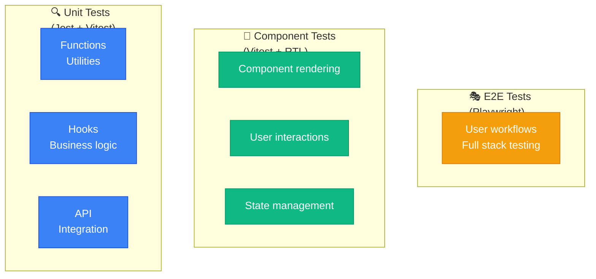

# Testing Guide - GeniuzLab Portfolio

Comprehensive guide to testing across the GeniuzLab Portfolio monorepo. This project uses multiple testing frameworks to ensure quality and reliability at every level.

## 📋 Table of Contents

1. [Testing Frameworks Overview](#testing-frameworks-overview)
2. [Code Linting (ESLint)](#code-linting-eslint)
3. [Backend Testing (Jest + Supertest)](#backend-testing-jest--supertest)
4. [Frontend Testing (Vitest + React Testing Library)](#frontend-testing-vitest--react-testing-library)
5. [E2E Testing (Playwright)](#e2e-testing-playwright)
6. [API Mocking (MSW)](#api-mocking-msw)
7. [Running Tests](#running-tests)
8. [Coverage Reports](#coverage-reports)
9. [Best Practices](#best-practices)
10. [Troubleshooting](#troubleshooting)

---

## 🧪 Testing Frameworks Overview

### Framework Stack

| Framework | Purpose | Scope | Language |
|-----------|---------|-------|----------|
| **Jest** | Unit & Integration Testing | Backend | TypeScript |
| **Vitest** | Unit & Component Testing | Frontend & Shared | TypeScript/TSX |
| **React Testing Library** | Component Testing | Frontend | TypeScript/TSX |
| **Playwright** | End-to-End Testing | Full Stack | TypeScript |
| **MSW** | API Mocking | Frontend Tests | TypeScript |
| **Supertest** | HTTP Assertion | Backend | TypeScript |

### Test Pyramid



**Testing Strategy:**
- **60%** - Unit tests (fast, focused, reliable)
- **30%** - Component tests (behavior verification)
- **10%** - E2E tests (critical user flows)

---

## � Code Linting (ESLint)

### Setup

Code quality is maintained using **ESLint 9** with TypeScript support.

**Configurations:**
- Backend: `apps/backend/eslint.config.mjs`
- Frontend: `apps/web/eslint.config.mjs`

### Running Linter

```bash
# Lint all packages
npm run lint

# Lint specific package
cd apps/web && npm run lint

# Fix linting issues automatically
cd apps/backend && npx eslint src --fix
```

### ESLint Rules

**Backend Configuration** (`apps/backend/eslint.config.mjs`)
- TypeScript support with `@typescript-eslint` parser
- Recommended rules from `@eslint/js` and `typescript-eslint`
- Custom rules:
  - `no-console`: warn (allow console.warn and console.error)
  - `@typescript-eslint/no-unused-vars`: error (allow underscore prefix)
  - `eqeqeq`: error (enforce === instead of ==)

**Frontend Configuration** (`apps/web/eslint.config.mjs`)
- Next.js specific rules (`eslint-config-next`)
- Core Web Vitals and TypeScript recommendations
- Automatic configuration by Next.js

### Ignoring Files

ESLint automatically ignores:
- `node_modules/`
- `dist/`, `build/`, `.next/`
- Test files (`__tests__/`, `.spec.ts`, `.test.ts`)
- Environment files (`.env*`)

To ignore specific files in a rule:
```typescript
// eslint-disable-next-line rule-name
const variable = value;

/* eslint-disable-next-line @typescript-eslint/no-explicit-any */
const data: any = {};
```

### Common Linting Issues

| Issue | Cause | Solution |
|-------|-------|----------|
| `Unexpected any` | Using `any` type | Use specific type or add `eslint-disable-next-line` |
| `Unexpected console` | console.log() calls | Use console.warn() or console.error() |
| `Expected '==='` | Using `!=` or `==` | Use `!==` or `===` instead |
| `is defined but never used` | Unused variable | Remove it or prefix with `_` |

### Disabling Rules

**Disable for entire file:**
```typescript
/* eslint-disable @typescript-eslint/no-explicit-any */
```

**Disable for one line:**
```typescript
// eslint-disable-next-line @typescript-eslint/no-explicit-any
const data: any = {};
```

**Disable specific rule in file:**
```typescript
/* eslint-disable-next-line rule-name */
```

---

## �🔧 Backend Testing (Jest + Supertest)

### Setup

Backend tests use **Jest** with **ts-jest** preset for TypeScript support and **Supertest** for HTTP testing.

**Configuration:** `apps/backend/jest.config.js`

### Test Structure

```
apps/backend/__tests__/
├── setup.ts                 # Jest setup and global configuration
├── utils/
│   └── test-helpers.ts     # Test utilities and mock generators
├── auth.example.test.ts    # Example unit tests
└── api.example.test.ts     # Example integration tests
```

### Writing Backend Tests

#### Unit Test Example

```typescript
// __tests__/auth.example.test.ts
describe('Auth Utilities', () => {
  describe('password validation', () => {
    it('should validate password strength', () => {
      const password = 'SecurePass123!';
      expect(password.length).toBeGreaterThanOrEqual(8);
    });

    it('should reject weak passwords', () => {
      const password = '123';
      expect(password.length).toBeLessThan(8);
    });
  });
});
```

#### Integration Test Example

```typescript
// __tests__/api.example.test.ts
import { TestRequest, generateTestProject } from './utils/test-helpers';

describe('Projects API', () => {
  describe('GET /api/admin/projects', () => {
    it('should return all projects', async () => {
      const api = new TestRequest(app);
      const response = await api.get('/api/admin/projects');
      
      expect(response.status).toBe(200);
      expect(Array.isArray(response.body)).toBe(true);
    });
  });
});
```

### Test Utilities

**File:** `apps/backend/__tests__/utils/test-helpers.ts`

Available helpers:

- `TestRequest` - Supertest wrapper for API testing
- `generateTestUser()` - Generate mock user data
- `generateTestProject()` - Generate mock project data
- `generateTestCategory()` - Generate mock category data
- `createMockDatabase()` - Mock database for unit tests
- `createMockAuthToken()` - Create mock JWT tokens
- `expectErrorResponse()` - Assert error responses
- `cleanupTestData()` - Clean up test database

### Running Backend Tests

```bash
# Run all backend tests
npm run test

# Run tests in watch mode
npm run test:watch

# Run tests with coverage
npm run test:coverage

# Run specific test file
cd apps/backend && npm test -- auth.example.test.ts
```

---

## ⚛️ Frontend Testing (Vitest + React Testing Library)

### Setup

Frontend tests use **Vitest** for speed and **React Testing Library** for component testing.

**Configuration:** `apps/web/vitest.config.ts`

### Test Structure

```
apps/web/__tests__/
├── setup.ts                         # Vitest setup and global configuration
├── utils/
│   └── test-helpers.ts             # Testing utilities
├── mocks/
│   └── handlers.ts                 # MSW API mock handlers
├── components/
│   └── ProjectCard.example.test.tsx # Example component tests
└── hooks/
    └── useImageUpload.example.test.ts # Example hook tests
```

### Writing Frontend Tests

#### Component Test Example

```typescript
// __tests__/components/ProjectCard.example.test.tsx
import { render, screen, userEvent, generateMockProject } from '../utils/test-helpers';
import ProjectCard from '@/components/work/ProjectCard';

describe('ProjectCard Component', () => {
  it('should render project information', () => {
    const project = generateMockProject({
      title: 'Amazing Design',
      description: 'Beautiful design work',
    });

    render(<ProjectCard project={project} />);

    expect(screen.getByText('Amazing Design')).toBeInTheDocument();
    expect(screen.getByText('Beautiful design work')).toBeInTheDocument();
  });

  it('should handle click on view project button', async () => {
    const project = generateMockProject();
    const user = userEvent.setup();

    render(<ProjectCard project={project} />);

    const button = screen.getByRole('button', { name: /view project/i });
    await user.click(button);

    expect(button).toBeInTheDocument();
  });
});
```

#### Hook Test Example

```typescript
// __tests__/hooks/useImageUpload.example.test.ts
import { renderHook, act, waitFor } from '@testing-library/react';
import { useImageUpload } from '@/hooks/useImageUpload';

describe('useImageUpload Hook', () => {
  it('should handle image upload', async () => {
    const { result } = renderHook(() => useImageUpload());

    const mockFile = new File(['image'], 'test.jpg', { type: 'image/jpeg' });

    await act(async () => {
      await result.current.upload(mockFile);
    });

    await waitFor(() => {
      expect(result.current.uploading).toBe(false);
    });

    expect(result.current.url).toBeTruthy();
  });
});
```

### Test Utilities

**File:** `apps/web/__tests__/utils/test-helpers.ts`

Available helpers:

- `render()` - Render React components with providers
- `screen` - Query DOM elements
- `userEvent` - Simulate user interactions
- `generateMockProject()` - Generate mock project data
- `generateMockProjects()` - Generate multiple projects
- `generateMockCategory()` - Generate mock category
- `generateMockCategories()` - Generate multiple categories
- `createFetchMock()` - Mock fetch responses
- `createFetchErrorMock()` - Mock fetch errors
- `fillForm()` - Fill form inputs
- `clickButton()` - Click buttons
- `expectVisible()`, `expectHidden()` - Visibility assertions
- `expectDisabled()`, `expectEnabled()` - State assertions

### MSW Mock Handlers

**File:** `apps/web/__tests__/mocks/handlers.ts`

Available endpoints:

- `GET /api/admin/projects` - List projects
- `POST /api/admin/projects` - Create project
- `GET /api/admin/projects/:id` - Get project
- `PUT /api/admin/projects/:id` - Update project
- `DELETE /api/admin/projects/:id` - Delete project
- `GET /api/admin/categories` - List categories
- `POST /api/admin/categories` - Create category
- `POST /api/admin/upload-image` - Upload image
- `POST /api/auth/signin` - Sign in
- `POST /api/auth/signout` - Sign out
- `GET /api/auth/session` - Get session

### Running Frontend Tests

```bash
# Run all frontend tests
npm run test

# Run tests in watch mode
npm run test:watch

# Run tests with coverage
npm run test:coverage

# Run tests with UI
npm run test:ui

# Run specific test file
cd apps/web && npm test -- ProjectCard.example.test.tsx
```

---

## 🎭 E2E Testing (Playwright)

### Setup

End-to-end testing uses **Playwright** to test user workflows across the entire application.

**Configuration:** `playwright.config.ts`

### Test Structure

```
e2e/
└── example.spec.ts    # Example E2E test scenarios
```

### Writing E2E Tests

#### E2E Test Example

```typescript
// e2e/example.spec.ts
import { test, expect } from '@playwright/test';

test.describe('Portfolio Website', () => {
  test.beforeEach(async ({ page }) => {
    await page.goto('/');
  });

  test('should load homepage successfully', async ({ page }) => {
    await expect(page).toHaveTitle(/GeniuzLab|Portfolio/);
    await expect(page.locator('header')).toBeVisible();
  });

  test('should navigate to work page', async ({ page }) => {
    const workLink = page.getByRole('link', { name: /work|portfolio/i });
    await workLink.click();
    await expect(page).toHaveURL(/work|portfolio/);
  });

  test('should work on mobile devices', async ({ page }) => {
    await page.setViewportSize({ width: 375, height: 812 });
    await expect(page.locator('header')).toBeVisible();
  });
});
```

### Running E2E Tests

```bash
# Run all E2E tests
npm run test:e2e

# Run with UI (recommended for development)
npm run test:e2e:ui

# Run specific test file
cd apps/web && npx playwright test e2e/example.spec.ts

# Run in headed mode (see browser)
cd apps/web && npx playwright test --headed

# Debug mode (step through tests)
cd apps/web && npx playwright test --debug
```

---

## 🔌 API Mocking (MSW)

### Setup

Mock Service Worker (MSW) provides seamless API mocking for tests without modifying application code.

**Configuration:** `apps/web/__tests__/mocks/handlers.ts`

### Customizing Handlers

Add new handlers to `handlers.ts`:

```typescript
import { http, HttpResponse } from 'msw';

export const handlers = [
  // Add your new handler
  http.get('/api/custom-endpoint', () => {
    return HttpResponse.json({
      data: 'your-data',
    });
  }),
  
  // Handle errors
  http.post('/api/failing-endpoint', () => {
    return HttpResponse.json(
      { error: 'Something went wrong' },
      { status: 500 }
    );
  }),
];
```

### Using Custom Handlers in Tests

```typescript
import { server } from '@/__tests__/mocks/handlers';
import { http, HttpResponse } from 'msw';

describe('My Component', () => {
  it('should handle custom API response', async () => {
    // Override default handler for this test
    server.use(
      http.get('/api/custom-endpoint', () => {
        return HttpResponse.json({ custom: 'data' });
      })
    );

    // Test code here
  });
});
```

---

## ▶️ Running Tests

### Run All Tests (Monorepo)

```bash
# Run tests in all packages
npm run test

# Run tests in watch mode
npm run test:watch

# Run tests with coverage
npm run test:coverage

# Run E2E tests
npm run test:e2e

# Run E2E tests with UI
npm run test:e2e:ui
```

### Run Tests by Package

```bash
# Backend only
cd apps/backend && npm test

# Frontend only
cd apps/web && npm test

# Shared package
cd packages/shared && npm test
```

### Test Commands Summary

| Command | Purpose |
|---------|---------|
| `npm test` | Run tests once |
| `npm run test:watch` | Run tests in watch mode |
| `npm run test:coverage` | Generate coverage report |
| `npm run test:e2e` | Run E2E tests |
| `npm run test:e2e:ui` | Run E2E tests with UI |
| `npm run test:ui` | Run component tests with UI (web only) |

---

## 📊 Coverage Reports

### Generate Coverage

```bash
# Generate coverage for all packages
npm run test:coverage

# View coverage report
# Open: apps/backend/coverage/index.html
# Open: apps/web/coverage/index.html
```

### Coverage Thresholds

Current coverage thresholds (minimum required):

- **Lines:** 50%
- **Functions:** 50%
- **Branches:** 50%
- **Statements:** 50%

To increase thresholds, update `jest.config.js` or `vitest.config.ts`:

```javascript
coverageThreshold: {
  global: {
    branches: 75,
    functions: 75,
    lines: 75,
    statements: 75,
  },
}
```

---

## ✅ Best Practices

### 1. Test Naming

Use clear, descriptive test names:

```typescript
// ✅ Good
it('should display error message when password is too short', () => {});

// ❌ Bad
it('validates password', () => {});
```

### 2. Arrange-Act-Assert Pattern

```typescript
describe('Component', () => {
  it('should update value on input change', async () => {
    // Arrange - set up test data
    const { user } = render(<MyComponent />);
    const input = screen.getByRole('textbox');

    // Act - perform the action
    await user.type(input, 'test value');

    // Assert - verify the result
    expect(input).toHaveValue('test value');
  });
});
```

### 3. Use Test Utilities

Leverage helper functions to reduce repetition:

```typescript
// ✅ Good - using helper
const project = generateMockProject({ title: 'My Project' });

// ❌ Bad - creating manually
const project = {
  id: '1',
  title: 'My Project',
  description: 'A test project',
  category: 'Design',
  // ... many more fields
};
```

### 4. Test Behavior, Not Implementation

```typescript
// ✅ Good - tests behavior
it('should display user greeting when logged in', () => {
  render(<Dashboard />);
  expect(screen.getByText(/hello john/i)).toBeInTheDocument();
});

// ❌ Bad - tests implementation
it('should call useUser hook', () => {
  const mockUseUser = jest.fn();
  // tests internal hook usage
});
```

### 5. Keep Tests Independent

```typescript
// ✅ Good - each test is independent
describe('Calculator', () => {
  it('should add two numbers', () => {
    expect(add(2, 3)).toBe(5);
  });

  it('should subtract two numbers', () => {
    expect(subtract(5, 3)).toBe(2);
  });
});

// ❌ Bad - tests depend on execution order
describe('Calculator', () => {
  let result;

  it('should add', () => {
    result = add(2, 3);
  });

  it('should check result', () => {
    expect(result).toBe(5);
  });
});
```

### 6. Mock External Dependencies

```typescript
// ✅ Good - mock external API
server.use(
  http.get('/api/projects', () => {
    return HttpResponse.json([mockProject]);
  })
);

// ❌ Bad - don't make real API calls
const response = await fetch('https://real-api.com/projects');
```

### 7. Test Edge Cases

```typescript
describe('ProjectFilter', () => {
  it('should handle empty category', () => {
    render(<ProjectFilter category="" />);
    // Assert behavior with empty category
  });

  it('should handle null projects', () => {
    render(<ProjectGrid projects={null} />);
    // Assert behavior with null
  });

  it('should handle very long project titles', () => {
    const longTitle = 'A'.repeat(500);
    const project = generateMockProject({ title: longTitle });
    // Assert rendering and truncation
  });
});
```

---

## 🐛 Troubleshooting

### Common Issues

#### 1. Tests Timeout

**Problem:** Tests exceed timeout limit

**Solution:**
```javascript
// Increase timeout in jest.config.js
testTimeout: 20000, // milliseconds

// Or in individual test
jest.setTimeout(20000);
```

#### 2. React Testing Library Query Fails

**Problem:** `screen.getByRole()` or similar queries fail

**Solution:**
```typescript
// Use screen.debug() to see current DOM
screen.debug();

// Use more flexible queries
screen.getByText('text', { exact: false });
screen.getByPlaceholderText('placeholder');
screen.getByDisplayValue('value');
```

#### 3. MSW Not Intercepting Requests

**Problem:** Fetch requests aren't being mocked

**Solution:**
```typescript
// Ensure MSW is set up in test file setup.ts
import { server } from './__tests__/mocks/handlers';

beforeAll(() => server.listen());
afterEach(() => server.resetHandlers());
afterAll(() => server.close());
```

#### 4. Next.js Routes Not Resolving

**Problem:** `next/router` or `next/navigation` not available in tests

**Solution:**
```typescript
// Ensure mocks are in setup.ts
vi.mock('next/router', () => ({
  useRouter: () => ({ push: vi.fn(), /* ... */ }),
}));

// Or use dynamic imports
const router = await import('next/router');
```

#### 5. Prisma Mocking Issues

**Problem:** Database queries fail in tests

**Solution:**
```typescript
// Use test database or mock PrismaClient
jest.mock('@prisma/client', () => ({
  PrismaClient: jest.fn(() => createMockDatabase()),
}));
```

### Debugging Tests

#### Visual Debugging

```bash
# View component during test
npm run test:ui            # Vitest UI (web)
npm run test:e2e:ui        # Playwright UI

# Print DOM to console
import { render, screen } from '@testing-library/react';
const { debug } = render(<Component />);
debug();
```

#### Step Through Tests

```bash
# Debug mode for Playwright
npx playwright test --debug

# Debug Node tests
node --inspect-brk node_modules/.bin/jest --runInBand
```

#### Check Test Coverage

```bash
# Generate and view coverage
npm run test:coverage
open apps/web/coverage/index.html
```

---

## 📚 Additional Resources

- [Jest Documentation](https://jestjs.io/docs/getting-started)
- [Vitest Documentation](https://vitest.dev/)
- [React Testing Library](https://testing-library.com/react)
- [Playwright Documentation](https://playwright.dev/)
- [MSW Documentation](https://mswjs.io/)
- [Testing Best Practices](https://github.com/goldbergyoni/javascript-testing-best-practices)

---

## 🤝 Contributing Tests

When contributing tests:

1. Write tests alongside features
2. Aim for 50%+ code coverage (configurable)
3. Follow existing test patterns and naming conventions
4. Use test utilities instead of creating mock data inline
5. Test behavior, not implementation
6. Keep tests simple and focused
7. Run all tests before submitting PR: `npm run test`

---

**Last Updated:** 2026-09-01
